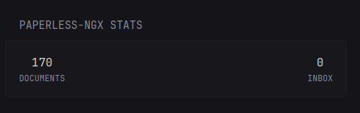

# Custom Glance Widgets

This is a collection of custom widgets for https://github.com/glanceapp.

- [paperless-ngx](https://github.com/anakles/glance-widgets?tab=readme-ov-file#paperless-ngx)
- 

---

## Paperless-ngx

A widget for [paperless-ngx](https://docs.paperless-ngx.com/).



**Usage**

Copy the content of the file [`paperless-ngx.yaml`](paperless-ngx/paperless-ngx.yaml) at the position you like.

|Parameter|Value|Example|
|---|---|---|
|`${PAPERLESS_URL}`|The URL of your paperless-ngx instance.|e.g. `https://paperless.example.com`|
|`${PAPERLESS_TOKEN}`|An API token for paperless-ngx. Currently, only token-based authentication is supported.</br>Take a look at the official [paperless-ngx documentation](https://docs.paperless-ngx.com/api/#authorization) on how to create an API token.||

The widgets requires two variables, which can be configured in
If you are using an `.env` file, add these lines:

```bash
# The URL to paperless-ngx
PAPERLESS_URL=https://paperless.example.com
# The API token for paperless-ngx
PAPERLESS_TOKEN=verySecureToken
```


---


